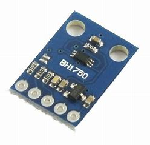

# BH1750
TiJOS driver for the BH1750 ambient light intensity sensor 

| 条目         | 说明                          |
| ---------- | --------------------------- |
| 驱动名称       | BH1750 环境光强度传感器               |
| 适用         | 该驱动适用于ROHM BH1750系列环境光强度传感器 |
| 通讯方式       | I2C                         |
| Java Class | TiBH1750.java               |
| 图片         |  |

